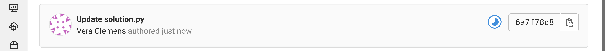
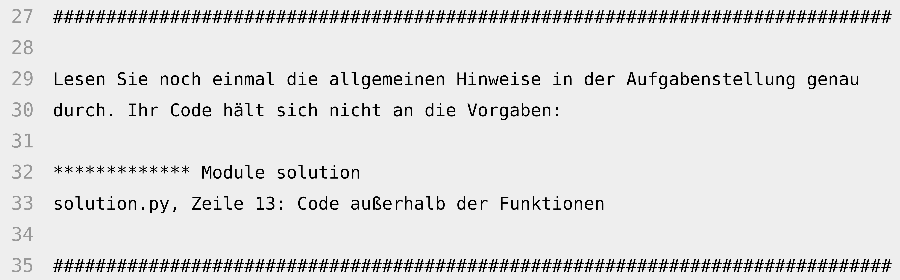

# GitLab Autograder

**Für die deutsche Version von diesem README [klick hier](README.md).**

This repository contains the instructions and useful scripts and templates for setting up an autograder for programming tasks using GitLab CI. As an example, the use for Python programming tasks is described here. However, the instructions can also be easily transferred to other programming languages. The user target group are students of a programming course.

The autograder uses two different test suites to evaluate the programming tasks: a public one, which is made available to the users, and a secret one. This is necessary to prevent the correct outputs from simply being hardcoded instead of the desired algorithm being implemented. The test suites are automatically run by GitLab CI each time a submission is made. The result is displayed graphically and in color (via the CI icon, which turns either red or green). Additional feedback texts can be displayed in the CI logs.

 
**Figure 1:** Screenshot of the presentation of the CI pipeline with colored icon.

 
**Figure 2:** Screenshot of the presentation of the results of the different CI pipeline steps.

 
**Figure 3:** Screenshot of the presentation of a feedback text when a test fails.

You can find a template for a manual that can be provided to the users under `user-manual-template`.

The students should not become dependent on the autograder, but also develop the ability to test their code themselves. Therefore, the autograder returns only a “pass” or “fail” for the two test suites. The desired user behavior after “fail” differs depending on the test suite:

- **Failed tests in the public test suite:** To find out exactly which tests failed and how, the user must run the tests themselves. (Ideally, if users have internalized testing their code, they should not upload code that fails the public tests in the first place.)
- **Failed tests in the secret test suite:** The inputs and expected outputs used in the failed tests cannot simply be output, otherwise hardcoding will be enabled. Instead, users are prompted to double-check their code and also add more test cases themselves. This is where a user could get “stuck”. So ideally, an instructor should be available to manually give a hint. The secret test suite should not contain “mean” edge cases that are not included in the public test suite. If this is ensured, it will almost prevent this case from occurring.

# Instruction

## Prerequisites

- GitLab instance where all users and all teachers have an account (tested with v14.10.5)
- at least one running [GitLab CI Runner](https://docs.gitlab.com/runner/install/)

## 1. Prepare programming tasks

A separate Git repository must be created for each programming task. The repository must contain:

- `README.md`: the task and instructions for editing in Markdown format (allows simple formatting like bold or italic text, lists, tables, links, images,...)
- `solution.py`: the template for the solution file (can be empty or already contain code to be modified or extended)
- `StudentTestSuite.py`: the public test suite (e.g. `unittest` tests)
- Image files included in the `README.md`, if any

A template for such a repository can be found at `task-template`.

*Caution:* A task repository should contain only a single commit, as this will be used as a basis for the test count check later on. It also looks cleaner to the users.

## 2. Upload programming tasks to GitLab

The programming task repositories must then be uploaded to GitLab. It is recommended to set up a group hierarchy for organization:

```
- <COURSE NAME> <YEAR>
-- Tasks
--- 1: <NAME>
--- 2: <NAME>
--- ...
```

All teachers should be added to the top group “`<CURSE NAME> <YEAR>`” at least as developers. One teacher should be owner of the group. “Tasks” is then a subgroup of this group. The task repositories are created inside it.

All groups should be private, especially if the programming tasks are to be staggered or not published immediately.

## 3a. Create task groups

Each submission group must correspond to a group on GitLab. The group hierarchy is expanded as follows:

```
- <COURSE NAME> <YEAR>
-- Submissions
--- <GROUPNAME>
--- <GROUPNAME>
--- ...
```

For example, the names of the group members can be chosen as group names. If each group consists of only one person, the group can simply be named after the person.

For the automatic creation of the groups there is a script under `scripts/step1_create_submission_groups.py` (see `README-en.md` in `scripts`). If the groups are created manually, the following must be observed:

- “Initial default branch protection” must be set to “Partially protected: Both developers and maintainers can push new commits, but cannot force push”. This will allow group members to add commits, but not to remove commits (which would require a force push).
- “Allowed to create projects” and “Allowed to create subgroups” should both be set to “Maintainers” so that group members cannot create additional repositories or subgroups.
- Groups should be private; otherwise, groups can view each other's repositories.

## 3b. Add users to the repository groups

To each group, members must then be added as developers.

For automatic adding, there is a script under `scripts/step2_add_members_to_submission_groups.py` (see `README-en.md` in `scripts`).

This step may need to be repeated several times later if not all users already have an GitLab account and need to register first.

## 4. Prepare GitLab CI

A GitLab CI pipeline must be configured with the desired test steps. Under `ci-config/en/ci-config.yml` there is a sample pipeline configuration which contains the following test steps:

1. `deadline-check`: checks if the deadline is exceeded
2. `attempt-number-check`: checks if the max. number of attempts is exceeded
3. `code-check`: checks if code syntax is correct and if code hints have been followed (e.g. no imports)
4. `student-test-suite`: execution of the public test suite
5. `verification-test-suite`: execution of the secret test suite

The test steps, especially `code-check`, can be customized as needed.

Before the pipeline can execute these test steps, the test scripts and test suites must first be loaded, and the required Python packages must be installed. This is done in the “before_script” block. The test scripts and suites are loaded from a Git repository, which must be created and filled with the files. There is a template for this under `ci-config/en/sample-repo`.

Of course, the repository must not be public, otherwise the secret test suite would no longer be secret. So to download the repository a token must be used, see [Project access tokens](https://docs.gitlab.com/ee/user/project/settings/project_access_tokens.html#project-access-tokens). The token must be available to the CI pipeline; the best way to do this is to create a protected CI variable in the Submissions group, see [Add a CI/CD variable to a group](https://docs.gitlab.com/ee/ci/variables/#add-a-cicd-variable-to-a-group).

(Alternatively, a separate Docker image could be built in which these preparations have already been made. In this case, it is a good idea to use the [GitLab Container Registry](https://docs.gitlab.com/ee/user/packages/container_registry/) if it is available in the GitLab being used.)

Then, another own CI configuration file must be created for each programming task, which specifies the deadline and the task number. There is an example for this under `ci-config/en/1-sample-task.yml`. All CI configuration files must now be provided read-only; the easiest way is to upload them to a web server. Now the URL of the task-specific configuration file must be entered in each task repository, see [Specify a custom CI/CD configuration file](https://docs.gitlab.com/ee/ci/pipelines/settings.html#specify-a-custom-cicd-configuration-file). This setting will not be lost later when forking.

The running GitLab CI runner must now be registered for the group “Submissions”, see [Create a group runner](https://docs.gitlab.com/ee/ci/runners/runners_scope.html#create-a-group-runner). A maximum pipeline runtime of e.g. 10 minutes should be set, since a run normally does not take longer.

Once this is done, the runner should now automatically run the configured pipeline for each commit made to a submission repository. It is best to check this once in a test submission repository.

## 5. Prepare automatic publishing of programming tasks

To make a programming task visible to users, the task repository created in step 2 must now be forked to each of the delivery groups. (The fork cannot be created by the users themselves, as this would make them owners of the copy and give them force push permission.)

For the automatic creation of forks there is a script under `scripts/step3_create_forks.py` (see `README-en.md` in `scripts`).

If a new task is to be released regularly, e.g. weekly, it is recommended to set up a cron job that automatically executes the script at a certain time. For this there is a shell script under `scripts/step3_create_forks.sh` (see `README-en.md` in `scripts`).

## 6. Export results of programming tasks

A task is considered passed by a group if the group has submitted at least one commit that passes all tests (i.e. whose CI pipeline status is green).

For automatically exporting the results per task there is a script at `scripts/step4_gather_results.py`. For the final evaluation whether the minimum number of programming tasks per group has been successfully completed, there is a script under `scripts/step5_generate_pass_fail_csv.py` (see `README-en.md` in `scripts`).

# Licenses

All scripts and program files in this repository are released under the GNU General Public License v3. All other text and image files are released under the CC BY-SA license.
