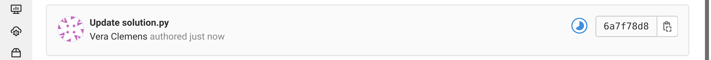
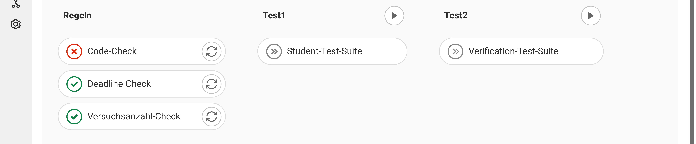
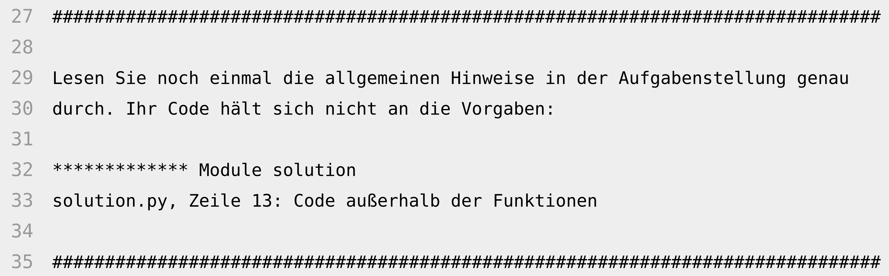

# GitLab Autograder

Dieses Repository enthält die Anleitung sowie nützliche Skripte und Vorlagen für die Einrichtung eines Autograders für Programmieraufgaben mittels GitLab CI. Beispielhaft wird hier der Einsatz für Python-Programmieraufgaben beschrieben. Die Anleitung lässt sich aber auch einfach auf andere Programmiersprachen übertragen. Die Nutzer-Zielgruppe sind Schüler bzw. Studenten.

Der Autograder nutzt zwei verschiedene Test-Suites, um die Programmieraufgaben zu bewerten: eine öffentliche, die den Nutzern zur Verfügung gestellt wird, und eine geheime. Dies ist notwendig, um zu verhindern, dass die korrekten Ausgaben einfach hartgecodet werden, statt den gewünschten Algorithmus zu implementieren. Die Test-Suites werden bei jeder Abgabe automatisch von GitLab CI ausgeführt. Das Ergebnis wird graphisch und farblich (über das CI-Icon, das entweder rot oder grün wird) angezeigt. In den CI-Logs können weitere Feedback-Texte angezeigt werden.

 
**Abbildung 1:** Screenshot der Darstellung der CI-Pipeline mit farbigem Icon

 
**Abbildung 2:** Screenshot der Darstellung der Ergebnisse der verschiedenen CI-Pipeline-Schritte

 
**Abbildung 3:** Screenshot der Darstellung eines Feedback-Texts bei fehlgeschlagenem Test

Unter `user-manual-template` gibt es eine Vorlage für ein Handbuch, das den Nutzern zur Verfügung gestellt werden kann.

Die Schüler/Studenten sollen nicht vom Autograder abhängig werden, sondern auch selbst die Fähigkeit entwickeln, ihren Code zu testen. Daher liefert der Autograder für die beiden Test-Suites nur ein „bestanden“ oder „nicht bestanden“ zurück. Das erwünschte Nutzer-Verhalten bei „nicht bestanden“ unterscheidet sich je nach Test-Suite:

- **Fehlgeschlagene Tests in der öffentlichen Test-Suite:** Um herauszufinden, welche Tests genau fehlgeschlagen sind und wie, müssen die Tests vom Nutzer selbst ausgeführt werden. (Wenn die Nutzer das Testen ihres Codes verinnerlicht haben, sollten sie idealerweise solchen Code, der die öffentlichen Tests nicht besteht, gar nicht erst hochladen.)
- **Fehlgeschlagene Tests in der geheimen Test-Suite:** Die in den fehlgeschlagenen Tests verwendeten Eingaben und erwarteten Ausgaben können nicht einfach ausgegeben werden, da sonst Hardcoding ermöglicht wird. Stattdessen werden die Nutzer aufgefordert, ihren Code noch mal genau zu prüfen und auch selbst noch weitere Testfälle hinzuzufügen. Hier könnte ein Nutzer „steckenbleiben“. Idealerweise sollte also eine Lehrperson bereitstehen, die manuell einen Hinweis geben kann. Die geheime Test-Suite sollte keine „gemeinen“ Randfälle enthalten, die in der öffentlichen Test-Suite nicht enthalten sind. So lässt sich das Auftreten dieses Falls nahezu verhindern.

# Anleitung

## Voraussetzungen

- GitLab-Instanz, in der alle Nutzer und alle Lehrpersonen einen Account haben (getestet mit v14.10.5)
- mind. ein laufender [GitLab CI Runner](https://docs.gitlab.com/runner/install/)

## 1. Programmieraufgaben vorbereiten

Für jede Programmieraufgabe muss ein eigenes Git-Repository angelegt werden. Das Repository muss enthalten:

- `README.md`: die Aufgabenstellung und Hinweise zur Bearbeitung in Markdown-Format (ermöglicht einfache Formatierungen wie fettgedruckten oder kursiven Text, Listen, Tabellen, Links, Bilder,...)
- `solution.py`: die Vorlage für die Lösungsdatei (kann leer sein oder bereits Code enthalten, der verändert oder erweitert werden soll)
- `StudentTestSuite.py`: die öffentliche Test-Suite (z.B. `unittest`-Tests)
- Evtl. in der `README.md` eingebundene Bilddateien

Eine Vorlage für ein solches Repository findet sich unter `task-template`.

*Achtung:* Ein Aufgaben-Repository sollte nur einen einzigen Commit enthalten, da davon später bei der Versuchsanzahl-Prüfung ausgegangen wird. Außerdem sieht das für die Nutzer sauberer und übersichtlicher aus.

## 2. Programmieraufgaben auf GitLab hochladen

Die Programmieraufgaben-Repositories müssen dann auf den GitLab-Server hochgeladen werden. Es empfiehlt sich zur Organisation der Aufbau einer Gruppenhierarchie:

```
- <KURSNAME> <JAHR>
-- Aufgaben
--- 1: <NAME>
--- 2: <NAME>
--- ...
```

Der obersten Gruppe „`<KURSNAME> <JAHR>`“ sollten alle Lehrpersonen mind. als Developer hinzugefügt werden. Eine Lehrperson sollte Owner der Gruppe sein. „Aufgaben“ ist dann eine Untergruppe dieser Gruppe. Darin werden die Aufgaben-Repositories angelegt.

Alle Gruppen sollten privat sein, insbesondere wenn die Programmieraufgaben gestaffelt oder nicht sofort veröffentlicht werden sollen.

## 3a. Abgabe-Gruppen anlegen

Jede Abgaben-Gruppe muss einer Gruppe auf GitLab entsprechen. Die Gruppenhierarchie wird folgendermaßen erweitert:

```
- <KURSNAME> <JAHR>
-- Abgaben
--- <GRUPPENNAME>
--- <GRUPPENNAME>
--- ...
```

Als Gruppennamen können z.B. die Namen der Gruppenmitglieder gewählt werden. Falls jede Gruppe nur aus einer Person besteht, kann die Gruppe einfach nach der Person benannt werden.

Für das automatische Anlegen der Gruppen gibt es ein Skript unter `scripts/step1_create_submission_groups.py` (siehe `README.md` in `scripts`). Falls die Gruppen manuell angelegt werden, muss folgendes beachtet werden:

- Die „Initial default branch protection“ muss auf „Partially protected: Both developers and maintainers can push new commits, but cannot force push.“ eingestellt werden. Damit wird den Gruppenmitgliedern erlaubt sein, Commits hinzuzufügen, aber nicht, Commits wieder zu entfernen (dafür wäre ein Force-Push notwendig).
- „Allowed to create projects“ und „Allowed to create subgroups” sollten beide auf „Maintainers” eingestellt werden, damit die Gruppenmitglieder keine weiteren Repositories oder Untergruppen anlegen können.
- Die Gruppen sollten privat sein; sonst können die Gruppen untereinander ihre Abgaben einsehen.

## 3b. Nutzer den Abgabe-Gruppen hinzufügen

Jeder Gruppe müssen dann die Mitglieder als Developer hinzugefügt werden.

Für das automatische Hinzufügen gibt es ein Skript unter `scripts/step2_add_members_to_submission_groups.py` (siehe `README.md` in `scripts`).

Dieser Schritt muss ggf. später noch mehrfach wiederholt werden, falls nicht alle Nutzer bereits initial einen GitLab-Account haben und sich erst registrieren müssen.

## 4. GitLab CI vorbereiten

Es muss eine GitLab CI-Pipeline mit den gewünschten Testschritten konfiguriert werden. Unter `ci-config/ci-config.yml` gibt es eine Beispiel-Pipeline-Konfigurigation, die folgende Testschritte enthält:

1. Deadline-Check: Überprüfung der Deadline
2. Versuchsanzahl-Check: Überprüfung, ob max. Versuchsanzahl überschritten ist
3. Code-Check: Überprüfung, ob Code-Syntax korrekt ist und Hinweise zum Code eingehalten wurden (z.B. keine Importe)
4. Student-Test-Suite: Ausführen der öffentlichen Test-Suite
5. Verification-Test-Suite: Ausführen der geheimen Test-Suite

Die Testschritte, insbesondere „Code-Check“, können je nach Bedürfnis angepasst werden.

Bevor die Pipeline diese Testschritte ausführen kann, müssen zunächst die Test-Skripte und die Test-Suites geladen werden sowie die benötigten Python-Pakete installiert werden. Dies wird im Block „before_script“ erledigt. Die Test-Skripte und -Suites werden dabei aus einem Git-Repository geladen, das angelegt und mit den Dateien gefüllt werden muss. Unter `ci-config/sample-repo` gibt es eine Vorlage dafür.

Das Repository darf natürlich nicht öffentlich sein, da sonst die geheime Test-Suite nicht mehr geheim wäre. Zum Herunterladen des Repositories muss also ein Token verwendet werden, siehe [Project access tokens](https://docs.gitlab.com/ee/user/project/settings/project_access_tokens.html#project-access-tokens). Das Token muss der CI-Pipeline zur Verfügung stehen; am besten wird dafür in der Gruppe „Abgaben“ eine geschützte CI-Variable angelegt, siehe [Add a CI/CD variable to a group](https://docs.gitlab.com/ee/ci/variables/#add-a-cicd-variable-to-a-group).

(Alternativ könnte auch ein eigenes Docker-Image gebaut werden, in dem diese Vorbereitungen bereits getroffen wurden. Dabei bietet sich die Nutzung der [GitLab Container Registry](https://docs.gitlab.com/ee/user/packages/container_registry/) an, falls diese im genutzten GitLab verfügbar ist.)

Für jede Programmieraufgabe muss dann noch eine eigene CI-Konfigurationsdatei angelegt werden, die die Deadline und die Aufgabennummer festlegt. Dafür gibt es ein Beispiel unter `ci-config/1-sample-task.yml`. Alle CI-Konfigurationsdateien müssen jetzt lesbar, aber schreibgeschützt bereitgestellt werden; am einfachsten ist es, sie auf einem Webserver hochzuladen. Jetzt muss in jedem Aufgaben-Repository die URL der aufgabenspezifischen Konfigurationsdatei eingetragen werden, siehe [Specify a custom CI/CD configuration file](https://docs.gitlab.com/ee/ci/pipelines/settings.html#specify-a-custom-cicd-configuration-file). Diese Einstellung geht später beim Forken nicht verloren.

Der laufende GitLab CI Runner muss nun für die Gruppe „Abgaben“ registriert werden, siehe [Create a group runner](https://docs.gitlab.com/ee/ci/runners/runners_scope.html#create-a-group-runner). Dabei sollte eine Maximal-Pipeline-Laufzeit von z.B. 10 Minuten eingestellt werden, da ein Durchlauf normalerweise nicht länger dauert.

Wenn das erledigt ist, sollte nun der Runner für jeden Commit, der in einem Abgaben-Repository gemacht wird, automatisch die konfigurierte Pipeline ausführen. Das sollte am besten einmal in einem Test-Abgaben-Repository überprüft werden.

## 5. Automatische Veröffentlichung der Programmieraufgaben vorbereiten

Um eine Programmieraufgabe für die Nutzer sichtbar zu machen, muss nun das in Schritt 2 angelegte Aufgaben-Repository in jede der Abgaben-Gruppen geforkt werden. (Der Fork kann nicht von den Nutzern selbst angelegt werden, da sie damit Owner der Kopie werden und damit die Berechtigung zum Force-Push erhalten würden.)

Für das automatische Anlegen der Forks gibt es ein Skript unter `scripts/step3_create_forks.py` (siehe `README.md` in `scripts`).

Falls regelmäßig eine neue Aufgabe freigeschaltet werden soll, z.B. wöchentlich, empfiehlt sich das Einrichten eines Cronjobs, der das Skript automatisch zu einem bestimmten Zeitpunkt ausführt. Dafür gibt es ein Shell-Skript unter `scripts/step3_create_forks.sh` (siehe `README.md` in `scripts`).

## 6. Ergebnisse der Programmieraufgaben exportieren

Eine Aufgabe gilt als von einer Gruppe bestanden, wenn die Gruppe mindestens einen Commit eingereicht hat, der alle Tests besteht (d.h. dessen CI-Pipeline-Status grün ist).

Für das automatische Exportieren der Ergebnisse je Aufgabe gibt es ein Skript unter `scripts/step4_gather_results.py`. Für die finale Auswertung, ob die Mindestanzahl an Programmieraufgaben pro Gruppe erfolgreich bearbeitet wurde, gibt es ein Skript unter `scripts/step5_generate_pass_fail_csv.py` (siehe `README.md` in `scripts`).

# Lizenzen

Alle Skripte und Programmdateien in diesem Repository werden unter der GNU General Public License v3 veröffentlicht. Alle weiteren Text- und Bilddateien werden unter der Lizenz CC BY-SA veröffentlicht.
